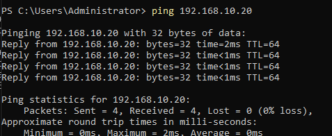
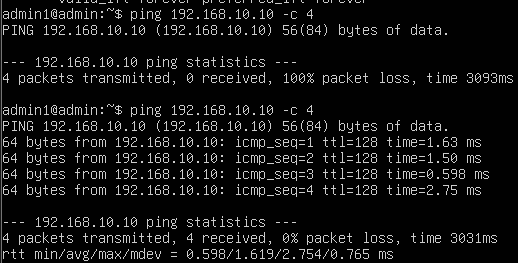
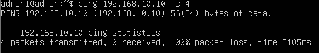
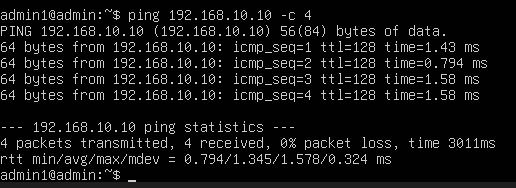
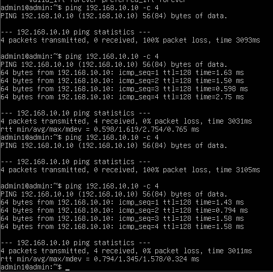
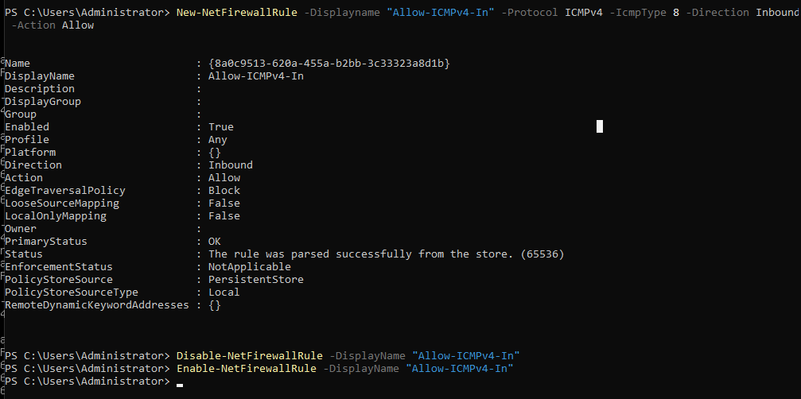

# Dzień 1: Setup VirtualBox + sieć między maszynami

## Cel
Postawienie dwóch maszyn wirtualnych (Windows Server 2022 Core + Ubuntu Server)
połączonych siecią wewnętrzną, ze statycznymi IP.

## Środowisko
- VirtualBox 7.x
- WIN-DC01: Windows Server 2022 Standard Evaluation (Server Core), 192.168.10.10
- UBU-SRV01: Ubuntu Server 24.04 LTS, 192.168.10.20
- Sieć: VirtualBox Internal Network "intnet"

## Kroki
1. Instalacja VirtualBox + Extension Pack
2. Utworzenie VM Windows Server (Server Core) i Ubuntu Server
3. Konfiguracja dwóch kart sieciowych na każdej maszynie (NAT + Internal Network)
4. Statyczne IP: Windows przez PowerShell (New-NetIPAddress), Ubuntu przez netplan

## Problemy napotkane i rozwiązania
1. **Instalator Windows nie widział licencji** — VirtualBox domyślnie włączył
   opcję "Unattended Installation", która źle się integrowała z ISO Windows
   Server. Rozwiązanie: ręczne odpięcie automatycznego nośnika i podpięcie ISO
   bezpośrednio w ustawieniach Storage.
2. **sconfig nie zapisywał statycznego IP** na karcie sieciowej mimo
   poprawnych danych wejściowych. Rozwiązanie: konfiguracja przez PowerShell
   (Set-NetIPInterface -Dhcp Disabled + New-NetIPAddress) zamiast przez sconfig.
3. **Ping z Ubuntu do Windows nie przechodził (100% loss)**, mimo że w drugą
   stronę działał. Diagnoza: Windows Firewall domyślnie blokuje przychodzące
   żądania ICMP Echo Request. Rozwiązanie: reguła firewalla zezwalająca na
   ICMPv4 (New-NetFirewallRule -Protocol ICMPv4 -IcmpType 8).

## Test
- Ping Windows → Ubuntu: SUKCES (0% loss)
- Ping Ubuntu → Windows: FAIL → SUKCES po dodaniu reguły firewalla
- Test blokady firewalla: po Disable-NetFirewallRule ping wrócił do 100% loss,
  po Enable-NetFirewallRule wrócił do 0% loss

## Screenshoty

